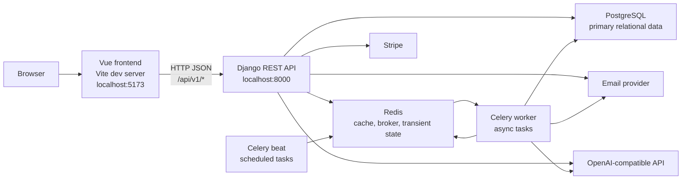
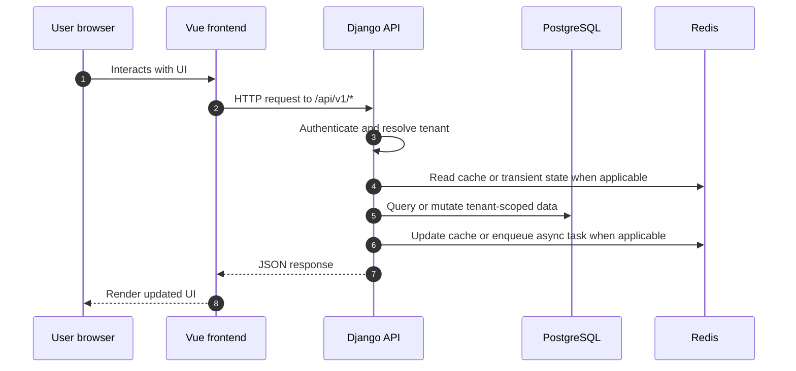
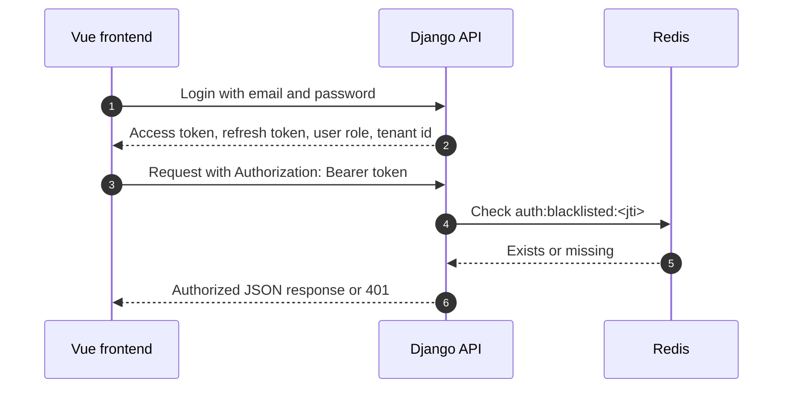
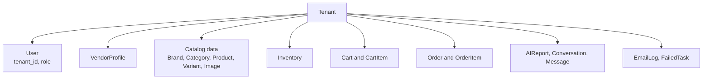
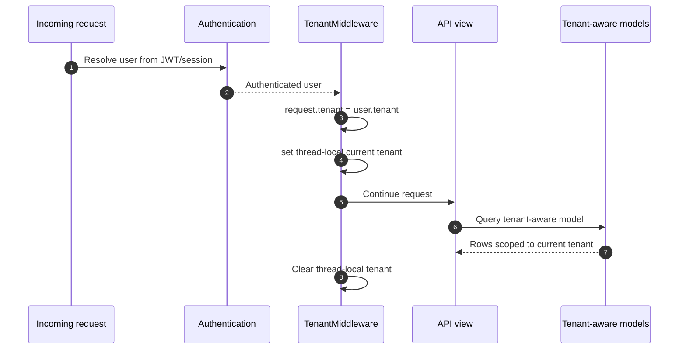
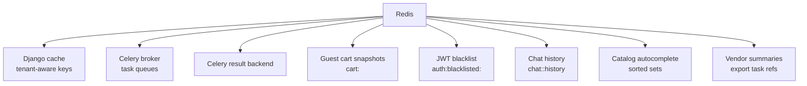
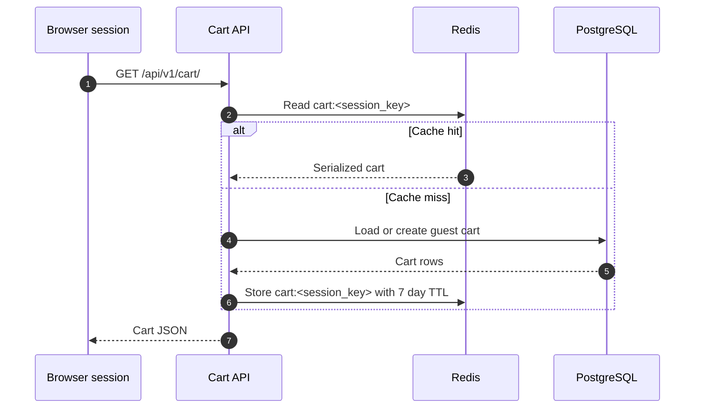
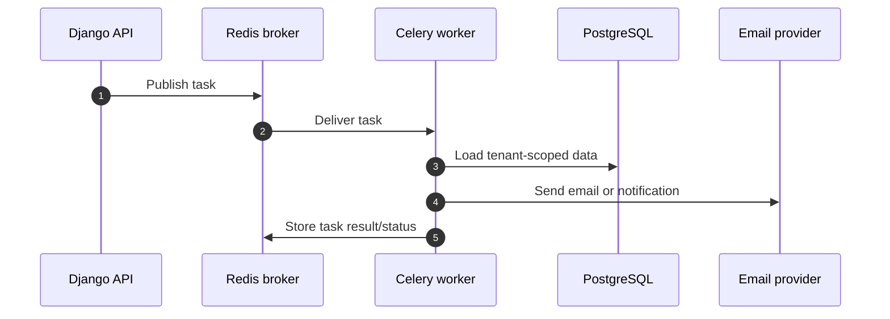

# Architecture

This document describes the high-level architecture of the distributed ecommerce
system, with focus on client-server separation, tenant isolation, and Redis
usage.

The project is split across three repositories:

- `ecommerce-frontend`: Vue 3 single-page application served by Vite.
- `ecommerce-backend`: Django REST API, domain logic, async workers, and data models.
- `ecommerce-infra`: Docker Compose orchestration for local development.

## System Overview

The application follows a client-server architecture. The frontend is a browser
client that renders user interfaces and sends HTTP requests to the backend API.
The backend owns authentication, authorization, tenant-scoped business logic,
database writes, background jobs, cache coordination, and third-party service
integration.



## Runtime Topology

Local development is coordinated by Docker Compose in this repository.

| Service | Purpose | Local port |
| --- | --- | --- |
| `frontend` | Runs the Vue/Vite client | `5173` |
| `web` | Runs Django REST API | `8000` |
| `db` | Stores relational application data | host `5433`, container `5432` |
| `redis` | Cache, Celery broker/results, transient state | `6379` |
| `celery_worker` | Executes background jobs | internal |
| `celery_beat` | Schedules recurring background jobs | internal |

The frontend receives the backend URL through `VITE_API_BASE_URL`. In local
development it points to:

```text
http://localhost:8000
```

The backend exposes API endpoints under:

```text
/api/v1/
```

## Client-Server Separation

The frontend and backend are intentionally separated by responsibility.

### Frontend Responsibilities

The frontend is responsible for:

- Rendering catalog, cart, checkout, profile, vendor, tenant registration, and chat UI.
- Holding short-lived UI state such as loading indicators, selected filters, and open panels.
- Reading `VITE_API_BASE_URL` and sending `fetch` requests to backend endpoints.
- Sending JWT bearer tokens for authenticated requests.
- Storing authentication/session state in browser storage where the current UI expects it.

The frontend does not directly access the database, Redis, Celery, Stripe secret
keys, tenant rules, or server-side permissions.

### Backend Responsibilities

The backend is responsible for:

- Authenticating users and issuing JWTs.
- Enforcing role and tenant permissions.
- Reading and writing Postgres data.
- Executing cart, checkout, catalog, vendor, order, notification, and AI logic.
- Publishing async jobs to Celery.
- Using Redis for cache and transient state.
- Calling external services such as Stripe, email delivery, and AI providers.

### Request Flow



### API Surface

The backend routes are grouped by domain:

| Route prefix | Domain |
| --- | --- |
| `/api/v1/auth/` | Register, login, refresh, logout, password reset |
| `/api/v1/users/` | Current user profile |
| `/api/v1/tenants/` | Tenant registration |
| `/api/v1/catalog/` | Categories, products, search, autocomplete |
| `/api/v1/cart/` | Cart and cart items |
| `/api/v1/checkout/` | Checkout session and payment intent |
| `/api/v1/orders/` | Customer and vendor order flows |
| `/api/v1/chat/` | AI chat and chat history |
| `/api/v1/vendor/` | Vendor dashboard, inventory, reports, exports |
| `/api/v1/admin/` | Request logs and admin-facing API views |
| `/api/v1/webhooks/stripe/` | Stripe webhook receiver |

## Authentication And Authorization

Authentication uses JWTs. Login returns access and refresh tokens. Authenticated
frontend requests include:

```text
Authorization: Bearer <access-token>
```

The backend uses a custom JWT authentication class that checks Redis-backed token
blacklist entries before accepting a token. This allows logout and token
revocation behavior without waiting for the access token to expire naturally.



Permissions are role-aware. Examples include customer-only checkout/order views
and vendor-admin-only vendor/product management views. Public catalog and some
chat endpoints allow anonymous access where the product experience needs it.

## Multi-Tenancy Design

The system uses shared-database multi-tenancy. Tenants share the same database
schema, and tenant-owned rows are separated with a `tenant_id` foreign key.

The central tenant model stores:

- Tenant name.
- Unique slug.
- Unique domain.
- Owner user.
- Plan.
- Active status.

Tenant registration creates the tenant, creates a vendor-admin user assigned to
that tenant, sets the tenant owner, and creates the initial vendor profile inside
one database transaction.



### Tenant Resolution

For authenticated requests, `TenantMiddleware` reads the tenant from
`request.user.tenant`, attaches it to `request.tenant`, and stores it in a
thread-local current tenant context for the lifetime of the request.



### Tenant-Aware Models

Shared tenant-owned models inherit from `TenantModel`. That mixin provides:

- A nullable `tenant` foreign key.
- `objects`, a tenant-aware manager that filters by the current tenant when one exists.
- `all_objects`, an unrestricted manager for system operations and explicit cross-tenant reads.

This design keeps normal application queries tenant-scoped while still allowing
admin, reporting, migrations, and carefully reviewed system code to access data
across tenants when needed.

### Tenant Isolation Rules

The main isolation rules are:

- Tenant-owned tables include `tenant_id`.
- Many uniqueness constraints include tenant scope, such as product slug per tenant.
- Authenticated vendor and customer flows filter data by `request.user.tenant`.
- Cache keys include a tenant prefix where cached data can differ by tenant.
- Background jobs receive tenant IDs or operate tenant-by-tenant when generating reports.

### Public Versus Tenant Context

Some catalog endpoints are available to anonymous users. In that case there may
be no current tenant, and cache keys use a public tenant scope:

```text
tenant:public
```

Authenticated requests use:

```text
tenant:<tenant_id>
```

This distinction keeps public catalog cache entries separate from tenant-specific
catalog entries.

## Redis Usage

Redis is a shared infrastructure dependency with several separate roles.



### 1. Django Cache Backend

Django cache uses `django_redis` with `REDIS_URL`. Cache keys are generated with
the custom tenant-aware key function:

```text
<CACHE_KEY_PREFIX>:tenant:<tenant_id-or-public>:v<version>:<key>
```

Example:

```text
ecommerce:tenant:42:v1:catalog:product-list:...
```

This matters because cached catalog responses, vendor summaries, and other
derived data must not leak across tenants.

### 2. Catalog Caching And Invalidation

Catalog product list and product detail responses use short-lived cache entries.
Their raw keys include tenant scope:

```text
catalog:product-list:tenant:<tenant_id-or-public>:<query_hash>
catalog:product-detail:tenant:<tenant_id-or-public>:<slug>
```

When a product changes, catalog signals invalidate affected product list and
detail cache patterns for the product tenant and public scope.

### 3. Autocomplete Suggestions

Product names are stored in tenant-scoped Redis sorted sets for autocomplete:

```text
catalog:autocomplete:tenant:<tenant_id-or-public>:product-names
```

The API reads suggestions from Redis and filters them by the typed prefix.

### 4. Guest Cart Cache

Guest carts are stored as Redis JSON snapshots keyed by browser session:

```text
cart:<session_key>
```

The TTL is seven days. Cart mutations invalidate the cached snapshot after the
database transaction commits. This keeps guest cart reads fast while preserving
Postgres as the source of truth.



### 5. JWT Blacklist

Logout writes blacklist entries into Redis by token JTI:

```text
auth:blacklisted:<jti>
```

The blacklist entry TTL is calculated from the token expiration. Every
authenticated request checks Redis before accepting the token.

### 6. Chat History

Chat history is stored in Redis for fast recent-context reads:

```text
chat:<session_id>:history
```

The chat store keeps the latest 20 entries with a 24 hour TTL. Messages are also
persisted to Postgres so history can fall back to durable storage if Redis is
empty or unavailable.

### 7. Celery Broker And Result Backend

Redis is both the Celery broker and result backend:

```text
CELERY_BROKER_URL = REDIS_URL
CELERY_RESULT_BACKEND = REDIS_URL
```

Celery queues are separated by purpose:

- `default`
- `emails`
- `ai`

Scheduled jobs are handled by Celery beat. The nightly AI sales report task runs
per active tenant so tenant reports remain isolated.



### 8. Vendor Dashboard And Exports

Vendor order summaries use Redis-backed Django cache with a short TTL. Vendor
order exports are started asynchronously through Celery, and the latest export
task ID is cached temporarily for lookup.

## Data Ownership Boundaries

Postgres remains the durable source of truth for:

- Tenants, users, roles, and vendor profiles.
- Catalog, inventory, cart, checkout, and orders.
- Notifications and request logs.
- AI reports and durable conversation messages.

Redis stores fast or temporary data:

- Cached API responses and summaries.
- Celery queue messages and task results.
- Token revocation state.
- Guest cart snapshots.
- Recent chat context.
- Autocomplete suggestion indexes.

The frontend owns presentation state only. Any state that must survive across
users, devices, workers, or deployments belongs in the backend.

## Failure Behavior

The system is designed so Redis improves speed and coordination but does not
replace durable storage for core records.

- If catalog cache misses, Django recomputes from Postgres.
- If guest cart cache misses, Django loads or creates the cart from Postgres.
- If chat Redis history is unavailable, Django falls back to stored conversation rows.
- If Celery is unavailable, async work such as email, exports, and reports will be delayed.
- If Postgres is unavailable, core reads and writes cannot proceed.

## Security And Isolation Notes

- Tenant-scoped data must always be filtered by tenant in API views, serializers, services, or model managers.
- Use `all_objects` only when a cross-tenant operation is intentional and reviewed.
- Never expose Stripe secret keys, database credentials, Redis credentials, or email provider secrets to the frontend.
- Public endpoints should treat `tenant:public` cache entries as separate from authenticated tenant entries.
- Protected endpoints should continue to require JWT authentication and role-specific permissions.
- Token blacklist checks depend on Redis, so logout and revocation behavior should be considered when operating Redis.

## Development URLs

| Tool | URL |
| --- | --- |
| Frontend | `http://localhost:5173` |
| Backend API | `http://localhost:8000/api` |
| Swagger | `http://localhost:8000/api/docs` |
| ReDoc | `http://localhost:8000/api/redoc` |
| Django admin | `http://localhost:8000/admin` |

## Adding New Features

When adding a feature, use this checklist:

- Add frontend UI in `ecommerce-frontend` and call the backend through `VITE_API_BASE_URL`.
- Add backend API routes under the correct `/api/v1/` domain.
- Decide whether the data is public, user-owned, tenant-owned, or system-owned.
- If tenant-owned, store `tenant_id` and filter by the current tenant.
- If cached in Redis, include tenant scope in the key.
- If work is slow or external-service dependent, enqueue it through Celery.
- Add tests for tenant isolation when data could cross tenant boundaries.

